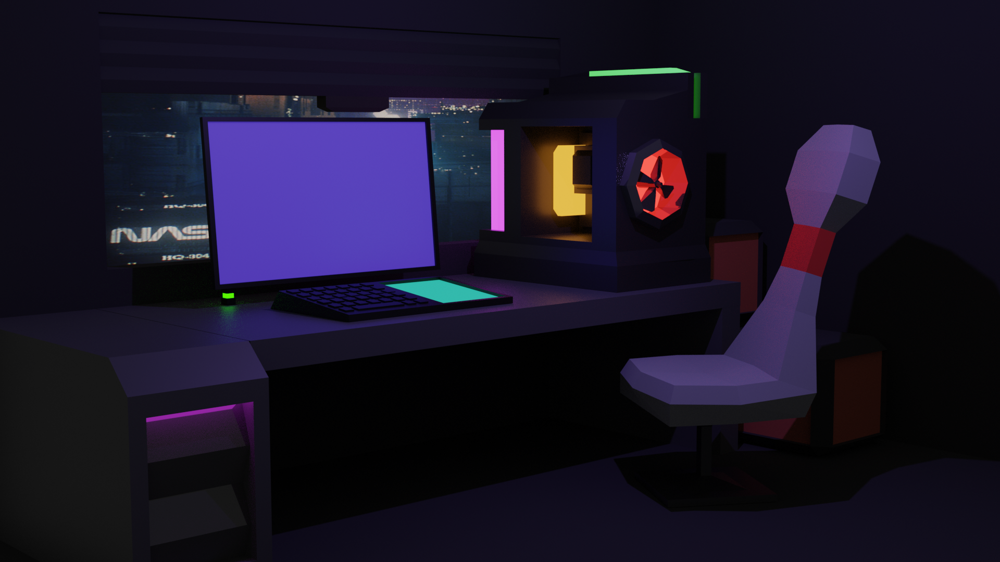

# The Neon Room
This is my very first blender project with low poly models.
The inspiration has been my own workstation, but the techniques used for this project were borrowed from **Imphenzia**.
> https://www.youtube.com/watch?v=onPhqlzDrzY&t=599s

*** 

